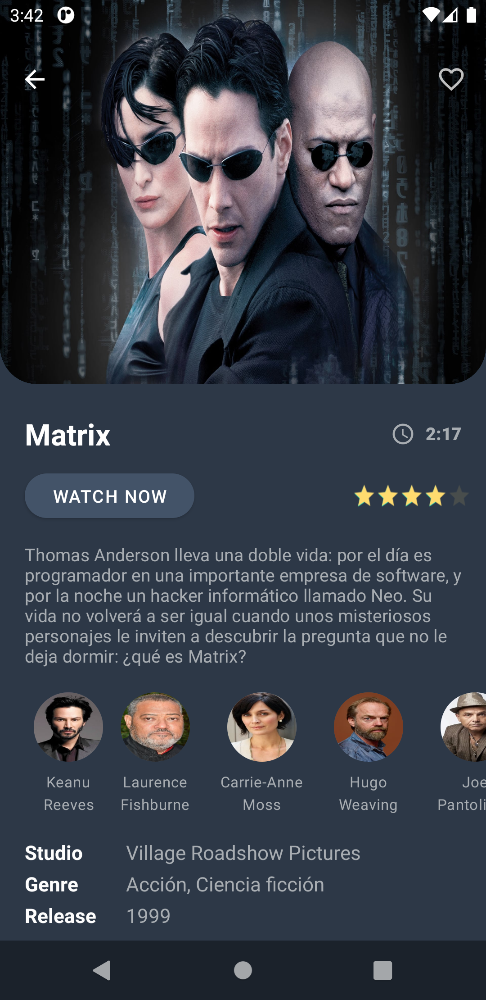

JetPack Compose Movie App
==========================

Movie app where **JetPack Compose** and **Architecture Components**
are used with **MVVM**. The
[TMDb](https://www.themoviedb.org/?language=es) &
[Trakt.tv](https://trakt.tv/) APIs are accessed to list the movie
catalog.

### Design credits
Thanks to Uplabs user
[@guillaumemick](https://www.uplabs.com/guillaumemick) for design
[Movies](https://www.uplabs.com/posts/movies-e0f9c1ea-a644-4666-857b-10933c4089ca).

### Preview

&nbsp;&nbsp;
