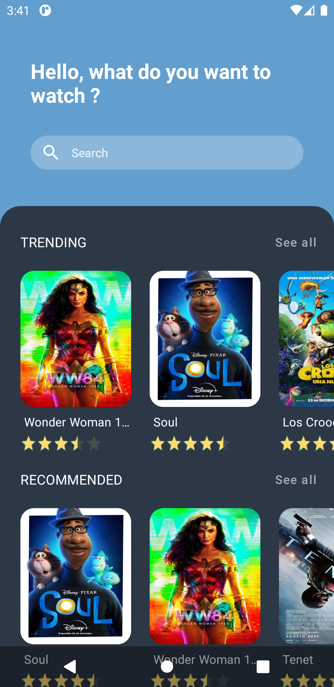

JetPack Compose Movie App
==========================

Movie app where **JetPack Compose** and **Architecture Components**
are used with **MVVM**. The
[TMDb](https://www.themoviedb.org/?language=es) &
[Trakt.tv](https://trakt.tv/) APIs are accessed to list the movie
catalog.

## Design credits
Thanks to Uplabs user
[@guillaumemick](https://www.uplabs.com/guillaumemick) for design
[Movies](https://www.uplabs.com/posts/movies-e0f9c1ea-a644-4666-857b-10933c4089ca).

## Preview
<div style="display:flex;">

&nbsp;

</div>

## LICENCE
````
MIT License

Copyright (c) 2020 Yender Vargas

Permission is hereby granted, free of charge, to any person obtaining a copy
of this software and associated documentation files (the "Software"), to deal
in the Software without restriction, including without limitation the rights
to use, copy, modify, merge, publish, distribute, sublicense, and/or sell
copies of the Software, and to permit persons to whom the Software is
furnished to do so, subject to the following conditions:

The above copyright notice and this permission notice shall be included in all
copies or substantial portions of the Software.

THE SOFTWARE IS PROVIDED "AS IS", WITHOUT WARRANTY OF ANY KIND, EXPRESS
OR IMPLIED, INCLUDING BUT NOT LIMITED TO THE WARRANTIES OF
MERCHANTABILITY, FITNESS FOR A PARTICULAR PURPOSE AND NONINFRINGEMENT.
IN NO EVENT SHALL THE AUTHORS OR COPYRIGHT HOLDERS BE LIABLE FOR ANY
CLAIM, DAMAGES OR OTHER LIABILITY, WHETHER IN AN ACTION OF CONTRACT,
TORT OR OTHERWISE, ARISING FROM, OUT OF OR IN CONNECTION WITH THE
SOFTWARE OR THE USE OR OTHER DEALINGS IN THE SOFTWARE.
````